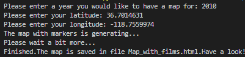
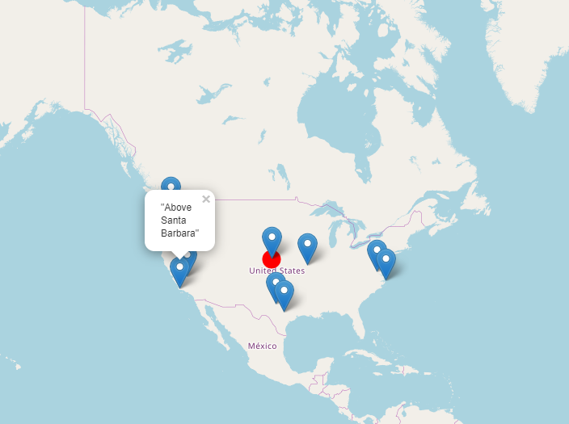
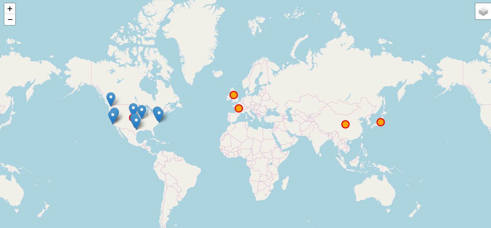

### web_map

This map contains information about movies that were filmed at a particular location and in a particular year. The user enters the year, which he/she wants to explore. Also, you have to enter the latitude and the longitude of the place near which you want to search for film locations. Then program starts to generate your map. There have to be no more than 10 markers on the map. When they are marked there, you can click on them and you will see the name of films that were filmed on this location. The map and these markers belong to the first and second layers. The third layer consists of five small circles that are on the countries, where cinematograph is well developed. The user can switch layers or even turn them off.

### Prerequisites

Modules folium and geopy have to be installed.

### The structure of the html file
It consists of three parts: head, body and script. The <head> is intended for browsers and search systems. <body> is the body of the document and it saves the content of the web page. As for <script> it is used to embed or refer to JavaScript code. Also html file uses cascading style sheets, which are used for design improvements of it.
  

### Examples of the generated map

### Conclusion

Generated map gives us information about the films that were filmed near entered location. Moreover, there are shown top 5 countries of cinematograph.

### Authors

Khrystyna Kokolus
